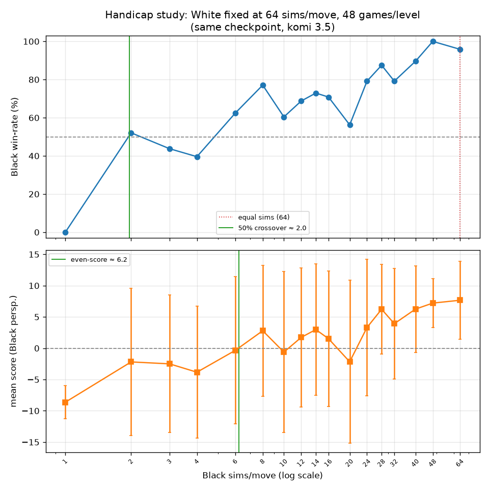
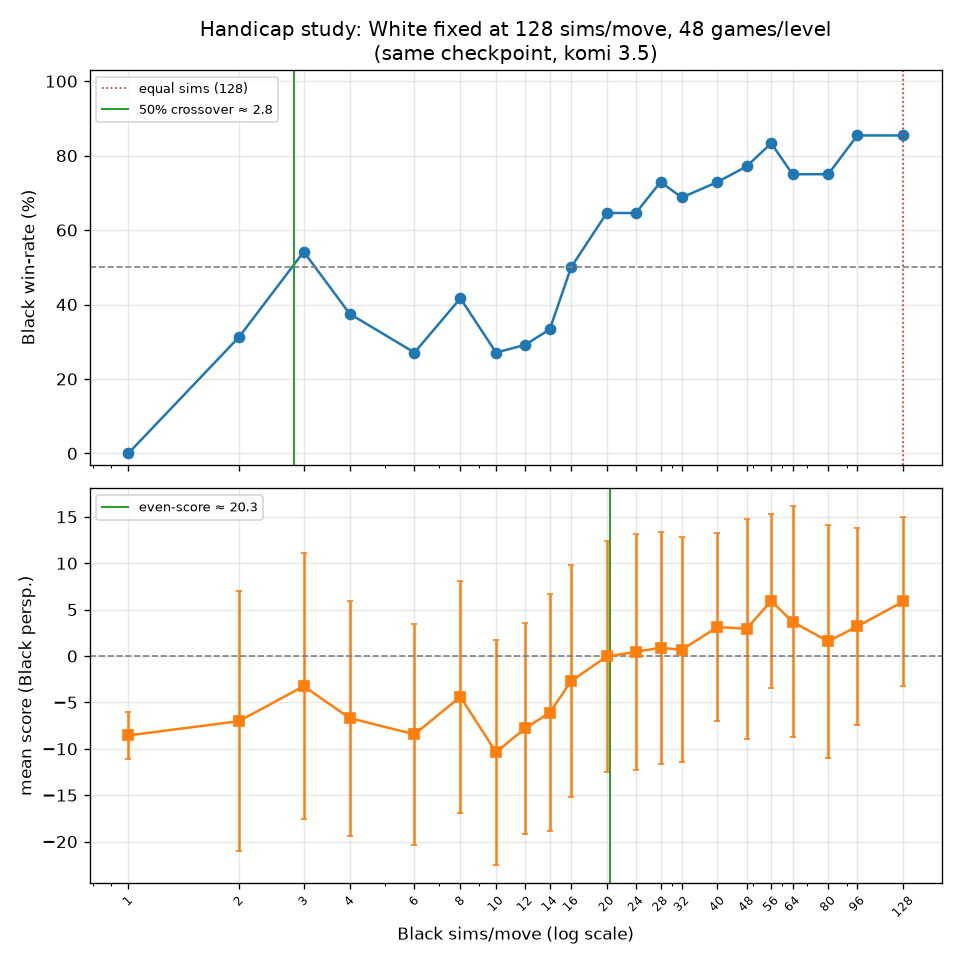
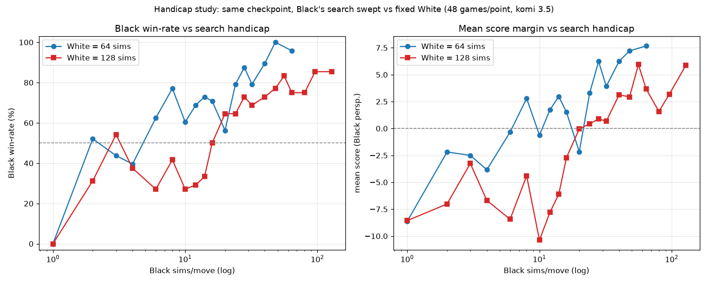

# alphago — a 5×5 Go agent, and a study of first-move advantage vs. search

A small **AlphaGo Zero–style** Go agent — a policy–value network plus Monte-Carlo
Tree Search (MCTS), trained **purely from self-play** (no human games) on a
**5×5** board. It learns from scratch and runs on a single GPU.

But the fun part isn't the agent — it's an experiment it makes easy: **on a tiny
board, how much do you have to handicap the first player's search before the
second player's deeper thinking actually wins?** Jump to
[the experiment](#the-experiment-how-big-is-the-first-move-advantage).

- **Trained weights:** 🤗 [nitishpandey04/alphago-zero-5x5](https://huggingface.co/nitishpandey04/alphago-zero-5x5) (`best.pt`, ~314k params)
- Trained on an NVIDIA RTX 5060 Ti (PyTorch, CUDA 12.8 wheels).

---

## Setup

Uses [uv](https://docs.astral.sh/uv/). An NVIDIA GPU is recommended (it falls
back to CPU, but slowly).

```bash
git clone https://github.com/nitishpandey04/alphago
cd alphago
uv sync                                                   # torch (cu128), numpy, matplotlib, ...
uv run python -c "import torch; print(torch.cuda.get_device_name(0))"   # check GPU
```

Grab the trained weights:

```bash
hf download nitishpandey04/alphago-zero-5x5 best.pt --local-dir checkpoints
```

---

## Run it

```bash
# Play against it (you are Black; enter moves like C3, B5, or 'pass')
uv run python -m scripts.play_human --checkpoint checkpoints/best.pt

# Watch it play itself
uv run python -m scripts.watch_game --black checkpoints/best.pt --white checkpoints/best.pt

# Train from scratch (self-play -> train -> arena loop)
uv run python -m scripts.train_main --config configs/default.yaml
#   ...or a ~1-minute pipeline check:
uv run python -m scripts.train_main --config configs/smoke.yaml
```

`watch_game` also takes `--black-sims` / `--white-sims` to give each side a
different MCTS budget from the *same* checkpoint (more sims = deeper search =
stronger play) — which is exactly the knob the experiment below turns.

---

## The experiment: how big is the first-move advantage?

On a 5×5 board, **Black (who moves first) has a large, structural advantage** —
small boards make the opening move extremely valuable, and komi only partly
compensates. With equal search, self-play games are *not* a coin flip: this
agent wins as Black ~**97%** of the time.

So: **how badly must we handicap Black's search before White's deeper thinking
overcomes that edge?** Because both players can run from the *same checkpoint* at
different simulation counts, we can measure it directly. `scripts/handicap_study.py`
fixes White's budget, sweeps Black's over a fine grid, plays many
randomized-opening games at each point, and plots Black's win-rate and mean score
margin:

```bash
uv run python -m scripts.handicap_study --white-sims 64 --games 16
# -> study/handicap_white64.png  +  study/handicap_white64.csv
```

### White = 64 simulations/move



The crossover is **startlingly low**. Against White's 64 simulations, Black
reaches a break-even win-rate at only **~5 simulations** — a **~13× search
deficit** — and only *loses the majority* once its search collapses to **≤4
sims** (essentially raw policy with no lookahead). Give Black even a handful of
simulations and the first-move advantage reasserts itself.

| Black sims vs White's 64 | Black win-rate | mean score (Black) |
|---|---|---|
| 1  | 0%   | −8.6 |
| 4  | 25%  | −8.9 |
| **~5** | **~50% (crossover)** | **~0** |
| 8  | 75%  | +4.8 |
| 64 (equal) | 100% | +7.8 |

### White = 128 simulations/move, and the side-by-side





Doubling White's search splits the two metrics:

- **Win-rate crossover barely moves: ~5 → ~6 sims.** Winning is binary, and
  Black's first-move advantage is so structural that a few simulations win *more
  often than not* regardless of how hard White searches.
- **Score-margin even point shifts ~3×: ~8 → ~24 sims.** *By how much* Black
  wins or loses is far more sensitive — a deeper White holds a points deficit
  over Black across a much wider range (red sits below blue in the comparison).

**Takeaway: on 5×5, extra search makes White lose by *less*, not win *more
often*.** The first move is worth so much that flipping the *result* requires
reducing Black to near-random play, while the *margin* responds smoothly to
search depth.

> The curves are deliberately noisy (16 games/point); the trend is the message,
> not any single wobble. Reproduce or refine any level with
> `uv run python -m scripts.handicap_study --white-sims <N> --games <M>`.

---

## License

MIT — see [`LICENSE`](LICENSE). An independent, educational reimplementation of
the AlphaGo Zero algorithm; not affiliated with or endorsed by DeepMind.
